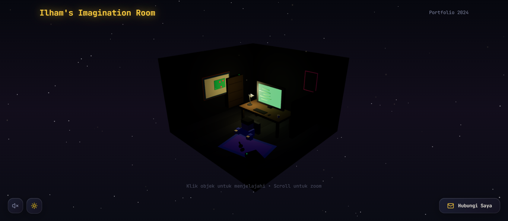

# 🌌 Ilham's Imagination Room

> *"Ada energi berbeda saat lewat tengah malam. Gangguan memudar, menyisakan fokus yang tajam. Ini adalah waktu di mana ide-ide rumit akhirnya menemukan bentuknya, tanpa interupsi."*

 ## 📖 About The Project

**Ilham's Imagination Room** adalah portofolio interaktif berbasis 3D yang dirancang untuk memvisualisasikan "ruang aman" seorang developer introvert. Bukan sekadar daftar proyek, website ini adalah representasi digital dari suasana kerja saya: tenang, fokus, dan hidup di tengah keheningan malam.

Dibangun dengan performa modern menggunakan **Vite** dan keindahan visual **Three.js**, pengunjung diajak untuk menjelajahi karya, skill, dan pemikiran saya melalui pengalaman visual yang imersif.

## ✨ Key Features

* **Immersive 3D Environment:** Ruang kerja 3D interaktif yang dapat dikontrol (OrbitControls).
* **Atmospheric Night Vibe:** Desain visual yang menekankan ketenangan, ruang angkasa, dan estetika "dark mode" sejati.
* **Interactive UI:** Elemen antarmuka yang responsif dan animasi halus menggunakan Framer Motion & CSS.
* **Project Showcase:** Galeri proyek yang terintegrasi dengan mulus ke dalam lingkungan 3D.
* **Responsive Design:** Tetap terlihat indah baik di desktop maupun mobile.

## 🛠️ Tech Stack

Project ini dibangun menggunakan teknologi web modern untuk menjamin performa dan skalabilitas:

* **Core:** [React](https://react.dev/) + [TypeScript](https://www.typescriptlang.org/)
* **Build Tool:** [Vite](https://vitejs.dev/)
* **Styling:** [Tailwind CSS](https://tailwindcss.com/)
* **3D & Graphics:** [React Three Fiber](https://docs.pmnd.rs/react-three-fiber) (R3F) & [Drei](https://github.com/pmndrs/drei)
* **UI Components:** [Shadcn UI](https://ui.shadcn.com/)
* **Icons:** [Lucide React](https://lucide.dev/)

## 📂 Project Structure

Struktur folder disusun untuk kemudahan pengembangan dan *maintainability*:

```text
src/
├── components/
│   ├── 3d/           # Komponen Three.js (Scene, Models, Lights)
│   ├── ui/           # Komponen UI (Buttons, Cards, Modals - Shadcn)
│   └── ...
├── hooks/            # Custom React Hooks
├── pages/            # Halaman utama aplikasi
├── lib/              # Utilitas dan helper functions
└── App.tsx           # Entry point utama

```

## 🚀 Getting Started (Panduan Instalasi)

Bagian ini akan memandu kamu langkah demi langkah untuk menjalankan salinan proyek ini di komputer lokal (Local Machine) kamu, baik untuk tujuan pengujian maupun pengembangan lebih lanjut.

### 📋 Prerequisites (Prasyarat)

Sebelum memulai, pastikan lingkungan pengembangan kamu sudah memenuhi syarat berikut agar tidak terjadi *error* versi:

* **Node.js (v18.0.0 atau lebih baru):** Proyek ini menggunakan teknologi modern yang membutuhkan runtime Node.js terbaru. Cek versimu dengan mengetik `node -v` di terminal.
* **Package Manager:** Kamu bisa menggunakan **npm** (bawaan Node.js), **yarn**, atau **bun** (direkomendasikan untuk kecepatan instalasi).
* **Git:** Pastikan Git sudah terinstal di komputer kamu untuk melakukan *cloning* repository.

### ⚙️ Installation Steps

Ikuti instruksi berikut secara berurutan untuk instalasi yang bersih:

**1. Clone Repository**
Unduh seluruh *source code* proyek ini dari GitHub ke direktori lokal komputermu. Buka terminal atau Command Prompt, lalu jalankan:

```bash
git clone [https://github.com/Useronetyu/imajinasi-ku.git](https://github.com/Useronetyu/imajinasi-ku.git)
cd imajinasi-ku

```

2. Install Dependencies Proyek ini memiliki beberapa ketergantungan library penting (seperti React, Three.js, Framer Motion) yang tercatat di file package.json. Instal semuanya dengan perintah berikut:

```bash
npm install

```

4. Akses Aplikasi Buka browser favoritmu (Chrome/Edge/Firefox) dan kunjungi alamat lokal berikut (biasanya port 5173, namun cek terminalmu untuk pastinya):

```bash
http://localhost:8080

```

🎨 Customization Guide (Panduan Modifikasi)
Ingin mengubah konten agar sesuai dengan identitas dan portofoliomu sendiri? Berikut adalah panduan detail untuk memodifikasi bagian-bagian utama:

1. Mengubah Teks & "Night Quotes"
Semua teks naratif, termasuk kutipan tentang "malam hari", data profil, dan deskripsi proyek, tersimpan dalam komponen UI.

Lokasi File: Cek folder src/components/ui/ atau cari komponen spesifik seperti src/components/NightFocusCard.tsx.

Cara Edit: Cari teks di dalam tag <p> atau dan ganti sesuai keinginanmu. Jika kamu menggunakan file data terpisah, cek folder src/lib/data.ts.

2. Mengganti Model 3D (Room & Objects)
Ruangan dan objek 3D dimuat menggunakan format .glb atau .gltf yang sudah dioptimasi.

Lokasi Aset: File model fisik (misal: my-room.glb) wajib disimpan di dalam folder public/models/ agar bisa diakses oleh browser.

Lokasi Logika: Komponen React yang memuat model tersebut berada di src/components/3d/. Kami menggunakan hook useGLTF dari library @react-three/drei.

Tips: Gunakan tool CLI gltfjsx untuk mengubah file .glb menjadi komponen React secara otomatis. Ini sangat memudahkan untuk memanipulasi shadow, material, dan interactivity.

3. Styling & Tema Warna
Proyek ini dibangun di atas Tailwind CSS, sehingga perubahan gaya visual sangat mudah dilakukan.

Konfigurasi Utama: Kamu bisa mengubah palet warna global, jenis font, atau breakpoints responsif di file tailwind.config.js.

Global CSS: Untuk variabel CSS global (seperti warna background default halaman), edit file src/index.css.

🤝 Contact & Socials
Saya selalu terbuka untuk kolaborasi, diskusi teknis, atau sekadar obrolan santai antar sesama penggiat teknologi. Jangan ragu untuk menghubungi saya jika kamu tertarik membahas:

Web Development: Diskusi seputar React, Three.js, atau arsitektur Frontend modern.

Machine Learning: Diskusi tentang algoritma (seperti Naive Bayes atau K-NN), Python, atau implementasi AI sederhana.

Gaming: Berbagi strategi Free Fire, nostalgia GTA San Andreas, atau sekadar mabar santai.

Temukan saya di:

```bash
📧 Email: (mochamadilhamhansyilalfauzi@gmail.com)

```

```bash
💼 LinkedIn: (https://www.linkedin.com/in/mochamad-ilham-hansyil-alfauzi-7574292bb/) 

```

```bash
🐙 GitHub: [github.com/username](https://github.com/Useronetyu/imajinasi-ku) 

```

<p> Built with ☕ (lots of it) and 💻 in the middle of the night.


© 2024 Ilham's Imagination Room. All rights reserved. </p>